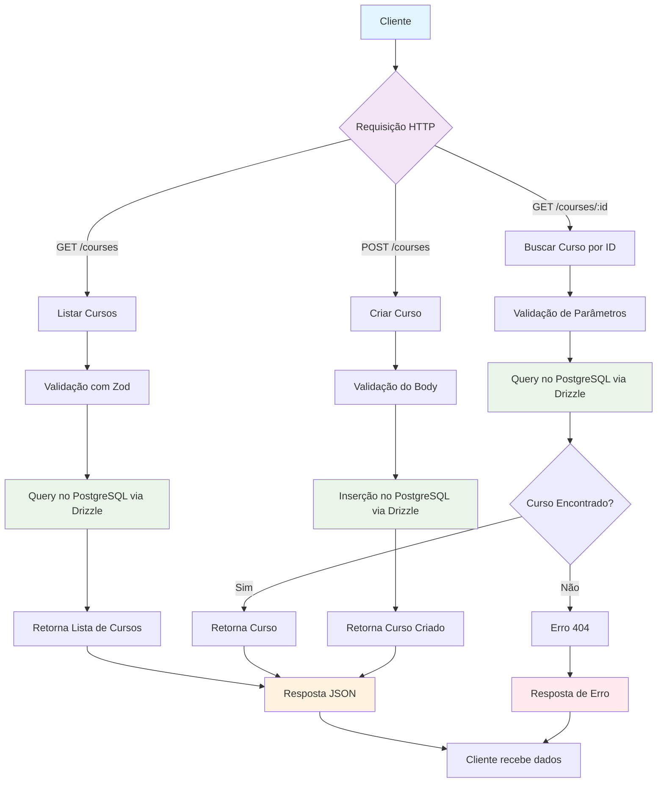

# Courses  API para gerenciamento de cursos utilizando Fastify, Drizzle ORM e PostgreSQL.  

## Tecnologias  

- Fastify 
- Drizzle ORM 
- PostgreSQL 
- Zod 
- Swagger  

## Fluxo da Aplicação

O diagrama abaixo ilustra o fluxo principal para as operações de gerenciamento de cursos:



### Componentes do Fluxo

1. **Cliente**: Aplicação ou usuário que consome a API
2. **Fastify**: Servidor HTTP que processa as requisições
3. **Zod**: Biblioteca de validação de dados de entrada
4. **Drizzle ORM**: Camada de abstração para o banco de dados
5. **PostgreSQL**: Banco de dados relacional onde os cursos são armazenados

## Estrutura  

```
api.http
biome.json
docker-compose.yml
drizzle.config.ts
package.json
swagger.json
tsconfig.json
src/
  db/
    connection.ts
    migrations/
      0000_charming_iron_fist.sql
      meta/
        _journal.json
        0000_snapshot.json
    schema/
      courses.ts
      index.ts
      users.ts
  env/
    env.ts
  http/
    server.ts
    routes/
      create-course.ts
      get-course-by-id.ts
      get-courses.ts
```

## Como rodar  

1. **Configure o banco de dados**  
   Edite o arquivo `.env` conforme o exemplo em `.env-example`.

2. **Suba o banco com Docker**  
   ```sh
   docker-compose up -d
   ```

3. **Instale as dependências**  
   ```sh
   npm install
   ```

4. **Execute as migrações**  
   ```sh
   npm run db:migrate
   ```

5. **Inicie o servidor**  
   ```sh
   npm run dev
   ```

## Endpoints  

- `GET /courses` — Lista todos os cursos
- `GET /courses/:courseId` — Busca curso por ID
- `POST /courses` — Cria um novo curso

## Documentação  

Acesse a documentação Swagger em [http://localhost:3333/docs](http://localhost:3333/docs) (modo desenvolvimento).


sequenceDiagram
  participant C as Client
  participant S as Fastify Server
  participant V as Zod Validator
  participant DB as Drizzle + PostgreSQL

  C->>S: POST /courses {title}
  S->>V: Validar body
  V-->>S: OK ou Erro 400
  alt válido
    S->>DB: INSERT INTO courses (title)
    DB-->>S: {id}
    S-->>C: 201 {courseId}
  else inválido
    S-->>C: 400
  end

  C->>S: GET /courses
  S->>DB: SELECT id,title FROM courses
  DB-->>S: lista
  S-->>C: 200 {courses: [...]} 

  C->>S: GET /courses/:id
  S->>V: Validar param id (uuid)
  V-->>S: OK ou Erro 400
  alt encontrado
    S->>DB: SELECT * FROM courses WHERE id=...
    DB-->>S: course
    S-->>C: 200 {course}
  else não encontrado
    S-->>C: 404
  end

## Teste rápido  

Utilize o arquivo [`api.http`](api.http) para testar os endpoints.

Feito com ❤️ usando Fastify e Drizzle ORM.